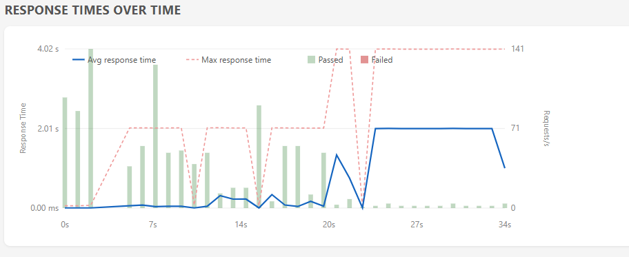
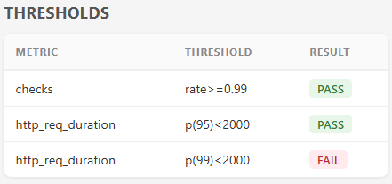
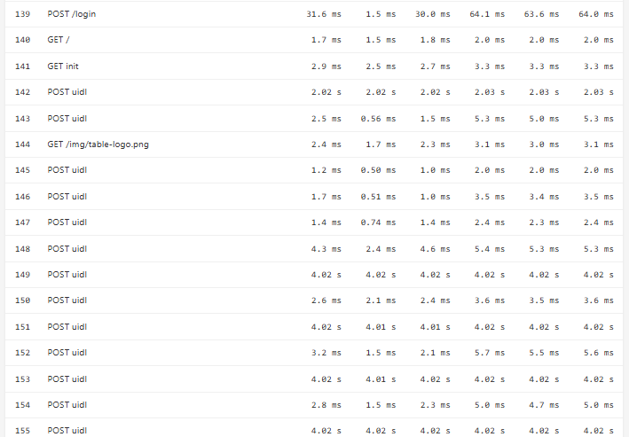

# Bookstore App Starter for Vaadin

An example project for a Vaadin application built with Spring Boot. The UI is built with Java only.

## Prerequisites

The project can be imported into the IDE of your choice as a Maven project, with Java 21 installed.

## Project Structure

The project follows the standard [Maven project layout](https://maven.apache.org/guides/introduction/introduction-to-the-standard-directory-layout.html).

## Workflow

To compile the entire project, run `mvn install` in the project root.

Other basic workflow steps:

- compiling the whole project
  - run `mvn install` in the project root
- developing the application
  - edit code in `src/main`
  - run `mvn spring-boot:run`
  - open http://localhost:8080/
- creating a production mode jar
  - run `mvn package`
- running in production mode
  - run `java -jar target/bookstore-example-1.0-SNAPSHOT.jar`
  - open http://localhost:8080/

### Running Integration Tests

Integration tests are implemented using TestBench. The tests take a few minutes to run and are therefore included in a separate Maven profile. To run the tests using Google Chrome, execute

```bash
mvn verify -Pit
```

and make sure you have a valid TestBench license installed.

### Running Load Tests

Record load tests with the TestBench `testbench-converter-plugin` plugin and run
them locally:

```bash
mvn verify -Plocal
```

```bash
# record only, without running load tests
mvn verify -Plocal,record-only

# record only with custom response check (response under 2s)
mvn clean verify -Plocal,record-only -Dk6.checks.custom="ALL|response under 2s|(r) => r.timings.duration < 2000"
```

Run recorded tests on a remote server (requires `testbench-loadtest-support` at
runtime):

```bash
cd loadttest
mvn verify -Dk6.appHost=staging.example.com
```

The load test summary and error log are written to the `target/k6/tests/report/` folder.

Starting the server with the `simulateSlowDB=true` system property slows down the inventory listing view, resulting in higher response times, which affects the load test results.

```bash
# start the production jar package simulating a slow SampleCrudView
java -DsimulateSlowDB=true -jar target/bookstore-example-1.0-SNAPSHOT.jar
# or simulate memory leak in login view (+10MB per each login view instance)
java -DsimulateMemoryLeak=true -jar target/bookstore-example-1.0-SNAPSHOT.jar
```
Load tests for SampleCrudView can fail due to threshold or custom check failures. See the examples below:
```bash
cd loadtest
# run the load test on the server running on localhost
mvn verify -Dk6.appHost=localhost

# run with 50 VUs and 1m duration
mvn verify -Dk6.appHost=localhost -Dk6.vus=50 -Dk6.duration=1m

# run with a 1s httpReqDurationP99 threshold
mvn verify -Dk6.appHost=localhost -Dk6.vus=50 -Dk6.duration=1m -Dk6.threshold.httpReqDurationP99=1000
```

Example response times with `simulateSlowDB=true` and 10 VUs. All tests run simultaneously, keeping average response time low at the beginning and in the middle, and high at the end when the slow inventory view is still fetching data (simulated with a 2s thread sleep):  


The 2s request duration threshold check fails the test with `k6.threshold.httpReqDurationP99=2000`.


Some requests show high request duration for the inventory view:


Other example runs:
```bash
cd  loadtest
# allow checks to fail without aborting the test
mvn verify -Dk6.appHost=localhost -Dk6.threshold.checksAbortOnFail=false

# run with a warmup iteration before the actual load test
mvn verify -Dk6.appHost=localhost -Dwarmup=true

# run a 2m stress test with 1000 VUs
mvn verify -Dk6.appHost=localhost -Dk6.vus=1000 -Dk6.duration=2m -Dk6.loadPattern=stress -Dk6.threshold.checksAbortOnFail=false
```

### Branching information:
* `vX` where X is the largest number is the latest version of the starter, using the latest platform version
